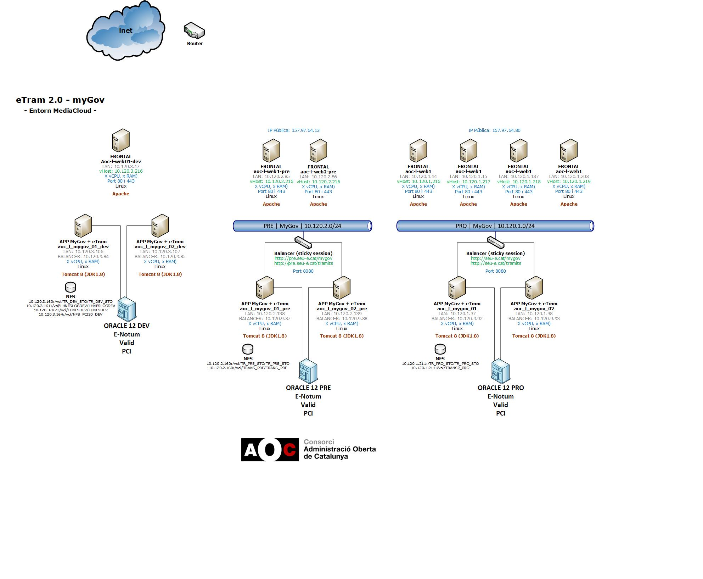

Sistemes : Diagrama de xarxa myGov + eTram 2.0 \[MCloud\]  

1.  [Sistemes](index.md)
2.  [Sistemes](Sistemes_13893749.md)
3.  [Arquitectura](Arquitectura_30869606.md)

Sistemes : Diagrama de xarxa myGov + eTram 2.0 \[MCloud\]
=========================================================

Created by Kenneth Capseta, last modified by Èric Antonell on 02 abril 2020

Attachments:
------------

 [myGov.png](attachments/30869651/30869652.png) (image/png)  
 [Diagrama eTram myGov.vsd](attachments/30869651/36340542.vsd) (application/octet-stream)  
 [Diagrama eTram myGov.jpg](attachments/30869651/36340543.jpg) (image/jpeg)  
 [image2020-4-2\_10-49-31.png](attachments/30869651/36340555.png) (image/png)  

Document generated by Confluence on 07 junio 2025 00:13

[Atlassian](http://www.atlassian.com/)