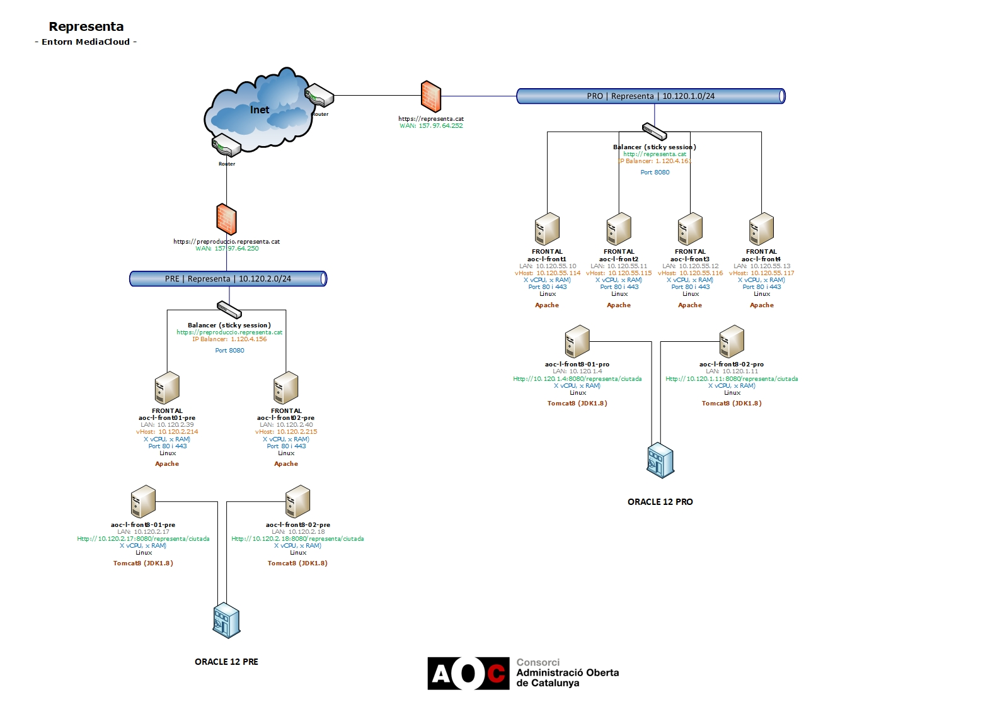

Sistemes : Diagrama de xarxa Representa \[MadiaCloud\]  

1.  [Sistemes](index.md)
2.  [Sistemes](Sistemes_13893749.md)
3.  [Arquitectura](Arquitectura_30869606.md)

Sistemes : Diagrama de xarxa Representa \[MadiaCloud\]
======================================================

Created by Kenneth Capseta, last modified on 11 marzo 2020

Attachments:
------------

 [Representa.vsd](attachments/36339773/36339774.vsd) (application/octet-stream)  
 [Representa.jpg](attachments/36339773/36339776.jpg) (image/jpeg)  
 [Representa.jpg](attachments/36339773/36339782.jpg) (image/jpeg)  
 [Representa.jpg](attachments/36339773/36339775.jpg) (image/jpeg)  
 [Diagrama Representa.jpg](attachments/36339773/36339995.jpg) (image/jpeg)  
 [Diagrama Representa.jpg](attachments/36339773/36339993.jpg) (image/jpeg)  

Document generated by Confluence on 07 junio 2025 00:13

[Atlassian](http://www.atlassian.com/)